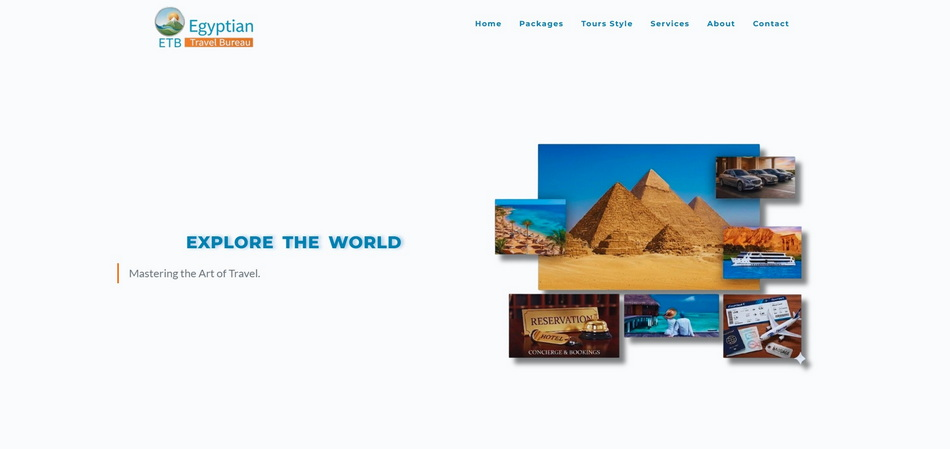
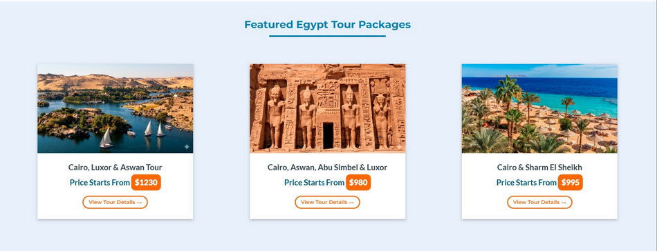
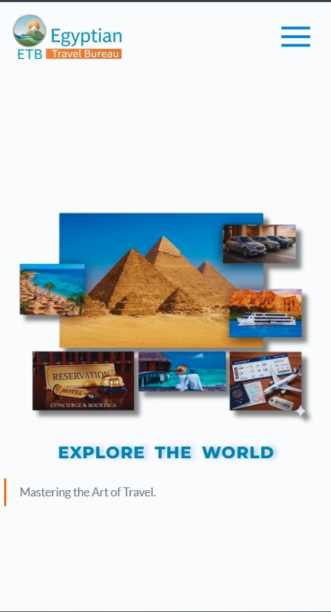

# ✈️ Egyptian Travel Bureau (ETB)

<p align="center">
  <strong>Luxury Travel Experiences Across Egypt — Designed with Precision</strong><br/>
  A high-end, conversion-focused landing page built to showcase curated travel journeys.
</p>

<p align="center">
  <a href="https://bassemhlmy.github.io/ETB/">🔗 Live Demo</a> •
  <a href="https://github.com/bassemhlmy/ETB">📂 Repository</a>
</p>

---

## 🧭 About The Project

**Egyptian Travel Bureau (ETB)** is a modern frontend project that simulates a premium travel agency platform focused on **luxury, clarity, and conversion**.

The goal wasn’t just to build a website—it was to craft a **visual sales experience** that guides users from inspiration to action.

This project reflects real-world priorities:

* Clean UI/UX
* Strong visual hierarchy
* Performance-focused structure
* Scalable and maintainable CSS

---

## ✨ Key Highlights

* 🎯 **Conversion-Driven Design**
  Strategic layout with clear call-to-actions and user flow

* 📱 **Fully Responsive**
  Optimized for mobile, tablet, and desktop experiences

* 🎨 **Premium Visual Identity**
  Consistent color system and typography inspired by luxury brands

* ⚡ **Performance-Oriented**
  Lightweight structure with fast load times

* 🧩 **Reusable Components**
  Structured sections for scalability and future expansion

---

## 🏗️ Tech Stack

| Category   | Technology           |
| ---------- | -------------------- |
| Structure  | HTML5                |
| Styling    | CSS3 (Flexbox, Grid) |
| Assets     | SVG, Web Images      |
| Deployment | GitHub Pages         |

---

## 🧠 Design Approach

This project focuses on **clarity over complexity**.

* Hero sections designed to immediately communicate value
* Content structured to reduce cognitive load
* Visual hierarchy guiding user attention naturally
* Balanced whitespace for a premium feel

The result is a layout that feels **intentional, not decorative**.

---

## 📂 Project Structure

```bash
ETB/
├── index.html
├── css/
│   └── style.css
├── images/
├── assets/
└── js/ (optional)
```

---

## 🚀 Getting Started

Clone the project and run locally:

```bash
git clone https://github.com/bassemhlmy/ETB.git
cd ETB
```

Then open:

```bash
index.html
```

---

## 🌐 Live Preview

👉 https://bassemhlmy.github.io/ETB/

---

## 📸 Visual Preview






---

## 🔮 Roadmap

* [ ] Integrate booking system (backend)
* [ ] Add animations & micro-interactions
* [ ] Improve SEO & structured data
* [ ] Enhance accessibility (WCAG standards)
* [ ] Convert into dynamic web app (React or similar)

---

## 🤝 Contributing

Contributions, ideas, and improvements are welcome.

1. Fork the repo
2. Create a new branch
3. Submit a pull request

---

## 📄 License

Distributed under the MIT License.

---

## 👨‍💻 Author

**Bassem Y. Helmy**

* GitHub: https://github.com/bassemhlmy
* LinkedIn: https://www.linkedin.com/in/bassemhlmy/

---

## 💡 Final Note

This project is part of my journey toward building **production-level frontend and data-driven applications**.

If you're reviewing this as a recruiter or collaborator, I’d love to connect.
